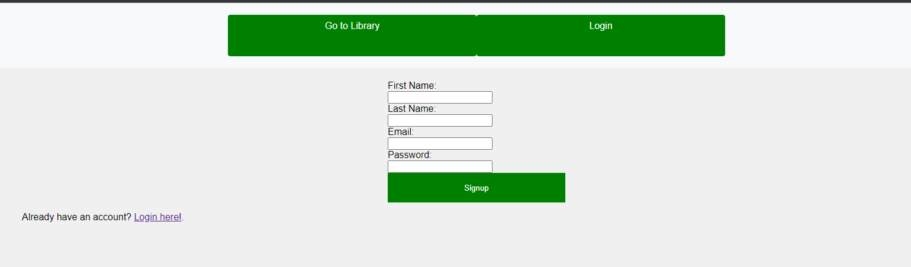

# Library Website
## Description
This is a website for a library. It allows users to search for books, view their details, and check them out. 
## Installation
To install this project, clone the repository and run the app.py file with Python.
Requires
- [Python 3.10](https://www.python.org/downloads/)
- [Flask](https://flask.palletsprojects.com/en/2.0.x/installation/)
- [werkzeug.security](https://pypi.org/project/Werkzeug/)
	
To begin one should generate the database and create the tables with the databasesetup.py file. Then, one should generate dummy data with the dummydata.py file. Finally, one should run the app.py file with Python.

Adding more films must be done directly with SQLite with images inserted into the bookImages folder. 

## Usage
To use this project, run the app.py file with Python. Then, navigate to the localhost address in your browser.

File Structure
```
📦Library Website					-- Root Directory
 ┣ 📂ImagesForMarkdown				-- Images for this README.md
 ┣ 📂static							-- Static Files
 ┃ ┣ 📂bookImages            		-- Images of book covers
 ┃ ┃ ┗ 📜lotr.jpg
 ┃ ┗ 📂css							-- CSS Files
 ┃ ┃ ┗ 📜main.css
 ┣ 📂templates						-- HTML Templates
 ┃ ┣ 📜book.html
 ┃ ┣ 📜booktable.html
 ┃ ┣ 📜index.html
 ┃ ┣ 📜login.html
 ┃ ┗ 📜signup.html
 ┣ 📜app.py							-- Main Python File
 ┣ 📜database.db					-- Database File 
 ┣ 📜database.py					-- Database File python connection
 ┣ 📜dbsetup.py						-- Database Setup File
 ┣ 📜dummydata.py					-- Dummy Data Generator
 ┗ 📜README.md						
 ```

 ## Images
 #### Home Page
 
 Library Website Home Page filtered by only checked out books.
 

#### Registration page.


#### Book page with lotr Image and description allowing user logged in to check out book.
 
A similar page is displayed when the book is checked out.

